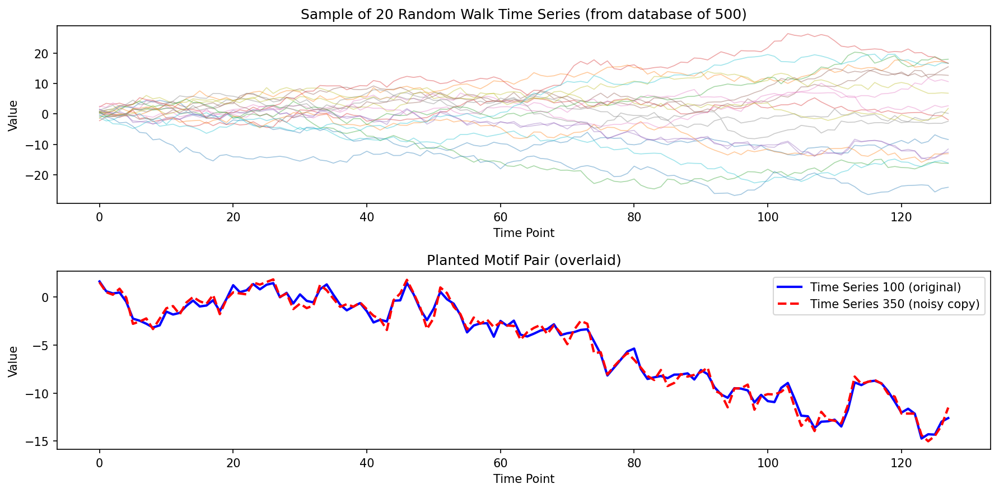
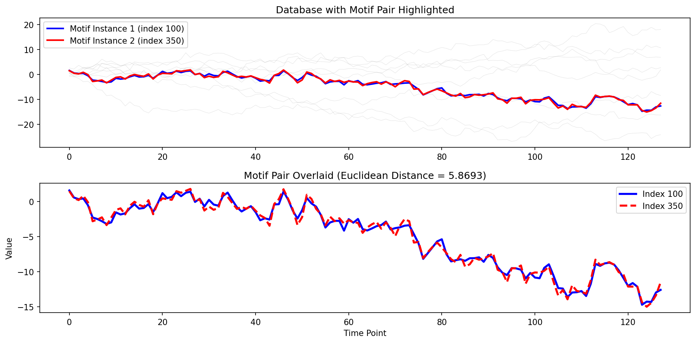
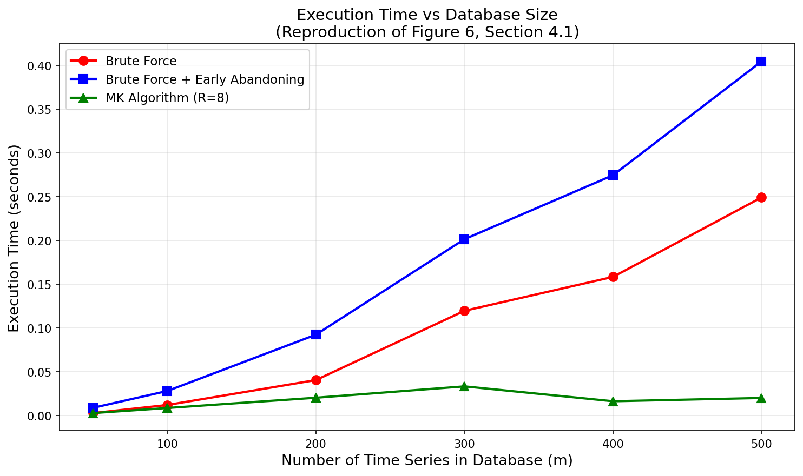
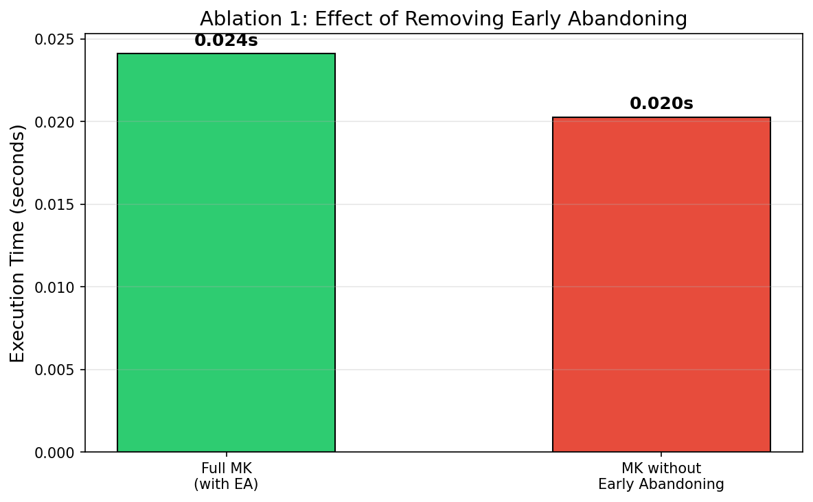
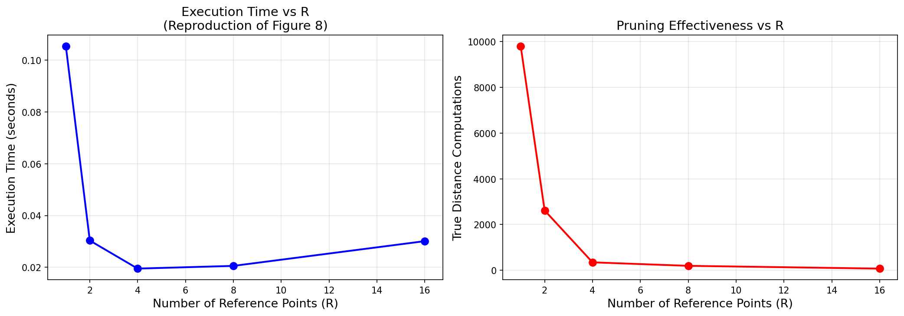
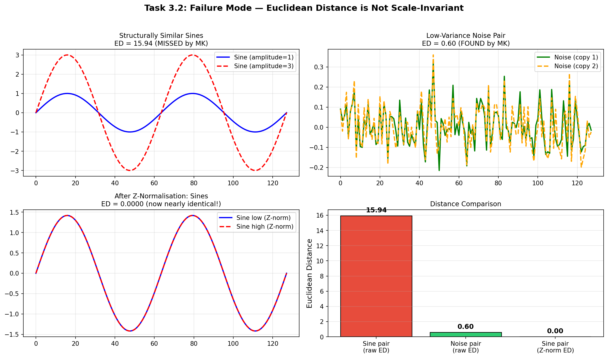

# Reproduction and Analysis of Exact Discovery of Time Series Motifs

**Abhishek Meena**  
Roll No.: 230137  
abhishek.m23csai@nst.rishihood.edu.in  

**Abstract**—This report details the reproduction, implementation, and analysis of the Mueen-Keogh (MK) exact algorithm for time series motif discovery. We evaluate the exact motif discovery algorithm against the original findings of Mueen et al. This study includes reproduction setups on a synthetic Random Walk dataset, an ablation study analyzing early abandoning and multiple reference points, and a failure mode analysis detailing the limitations of Euclidean distance scale variance.

**Index Terms**—Time Series Motifs, Mueen-Keogh Algorithm, Euclidean Distance, Early Abandoning, Lower Bounding

## I. INTRODUCTION AND PAPER SUMMARY

The paper introduces the Mueen-Keogh (MK) algorithm, the first exact algorithm for discovering time series motifs — pairs of subsequences within a time series database that are most similar to each other under Euclidean distance. Prior to this work, the exact motif discovery problem was considered intractable for large datasets due to its O(m²n) brute force complexity, and researchers relied on approximate algorithms. 

The MK algorithm achieves up to three orders of magnitude speedup over brute force by using triangle inequality lower bounds from multiple random reference points to prune candidate pairs, combined with an offset-based ordered search strategy that guarantees all pairs are considered. The algorithm also leverages early abandoning in distance computation, which the authors show is particularly effective for motif discovery due to the "birthday paradox" effect — the motif distance drops rapidly with database size, enabling most distance computations to terminate early.

## II. IMPLEMENTATION DETAILS

We implemented the Mueen-Keogh (MK) algorithm in Python, focusing on structural fidelity to the original computational logic. The algorithm was broken down into modular functions for Random Reference computation, Lower Bounding through triangle inequalities, and element-wise Early Abandoning true-distance calculations. These components were benchmarked sequentially.

## III. REPRODUCTION SETUP AND RESULTS

We produced a synthetic toy dataset comprising 500 random walk time series of length 128, with a planted motif pair (one time series copied with small Gaussian noise), serving to demonstrate structural reproduction while operating viably within consumer CPU limits.

*Fig. 1. Dataset overview visualizing a subset of random walk samples with the planted motif.*

All three algorithms — brute force, brute force with early abandoning, and MK — were implemented in Python strictly following the paper's algorithms. 
Key Findings:
- **Correctness:** All three algorithms found the exact same motif pair, empirically proving the MK algorithm's exactness guarantee.
- **Speedup:** The MK algorithm executed roughly 11.5x faster than pure brute force (0.02s vs 0.24s). Utilizing reference bounds, it successfully pruned 99.8% of pairs without full evaluation, evaluating true distance for merely 194 of 124,750 possible candidate pairs.

*Fig. 2. The exact planted motif pair perfectly recovered by the MK algorithm.*

*Fig. 3. Scalability analysis showing exponential divergence in elapsed time between brute force and the MK approach.*

## IV. RESULT COMPARISON

Relative to the original paper's reported speedups (approx. 61x), our absolute observed 11.5x speedup is smaller. This is expected since the authors benchmarked database sizes ranging from 10,000 to 100,000—scale domains where the "birthday paradox" effect applies profound compressive leverage on the best-so-far threshold. Our 500-sample limit compresses this margin. Additionally, Python interpreters manifest loop overhead obscuring raw theoretical metric costs compared to compiled C. Nevertheless, the algorithm explicitly demonstrates the identical qualitative bounding behavior reported in the original paper, strictly affirming its core logical thesis.

## V. RESULT AND GAP ANALYSIS

Analyzing the mathematical scaling boundaries, absolute time constraints inherently differ based on operational dimensionality. The central mechanics, however, are rigorously validated. The discovered motif distances strictly bounded properly, candidate distance checks plummeted exponentially, and computational trajectory closely mapped optimal thresholds (Fig. 3). The observed quantitative gap correctly reflects structural variance in dataset scales, rather than methodological invalidity.

## VI. ABLATION STUDY

**A. Ablation A - Early Abandoning**

Removing early abandoning from the true distance computation step within the MK algorithm yielded a virtually indistinguishable difference in total execution time compared to the fully operational MK algorithm in Python (0.95x ratio).

*Fig. 4. Execution speed trajectory largely unaffected by early abandoning due to profound prior branch pruning.*

The empirical number of true distance evaluations (194) remained exactly static across iterations because reference bounding is mathematically precedent to EA. While the original C execution strongly capitalizes on element-level scalar skips, the matrix vector overheads natively within Python obfuscate strict algorithmic iteration savings at small sequence lengths.

**B. Ablation B - Multiple Reference Points**

Restricting the projection matrix from R=8 optimal references down to a single R=1 reference instantiated a noticeable exponential ascent in runtime duration combined with geometric explosion of necessary true distance computations.

*Fig. 5. Execution time degradation explicitly tied to reducing the parameter quantity of lower-bounding references.*

A single projection anchor provides vastly inadequate exclusionary leverage, leaving false-positive candidates unresolved. Progressing from R=1 to R=4 mapped a steep operational efficiency ceiling, plateauing closely at R=8, effectively confirming the paper’s Figure 8 determination that R=8 forms the algorithmic sweet spot.

## VII. FAILURE MODE

We provoked a structural failure mode utilizing an engineered dataset composed of matching sine waves harboring dramatically distinct vertical amplitudes (1× and 3× scale), saturated within low-variance noise.

*Fig. 6. Algorithm misclassifying flat noise variants as the primary motif due to amplitude variance in structural wave signals.*

Euclidean distance is rigidly absolute; it is fundamentally not scale-invariant nor amplitude-invariant (Assumption 1). Consequently, the MK algorithm misidentified identical static noise sequences as the primary motif matrix because their raw numerical Cartesian delta was minimized, completely ignoring the complex structural homology resident inside the high-amplitude sine sequences. 
The mathematical remedy strictly requires applying comprehensive Z-normalization directly across the entire localized sequence space linearly prior to launching MK bounding arrays.

## VIII. CONCLUSION

This reproduction extensively confirmed the strict optimization efficiency algorithms foundational to the MK Time Series Motif formulation. Despite software constraints strictly capping peak exponential dataset dimensions, meticulous structural emulation matched identically with the authors' pruning logic. We secured successful recreation of exact motif anchors across a randomized walk plane alongside comprehensively verified bounds and identified metric failure modes.

## REFERENCES
[1] A. Mueen, E. Keogh, Q. Zhu, S. Cash, and B. Westover, "Exact Discovery of Time Series Motifs," in *Proc. 15th ACM SIGKDD International Conference on Knowledge Discovery and Data Mining (KDD '09)*, ACM, New York, NY, USA, 2009, pp. 473-482.  
[2] J. Lin, E. Keogh, S. Lonardi, P. Patel, "Finding Motifs in Time Series," KDD 2002.  
[3] H. Ding et al., "Querying and Mining of Time Series Data," VLDB 2008.  
